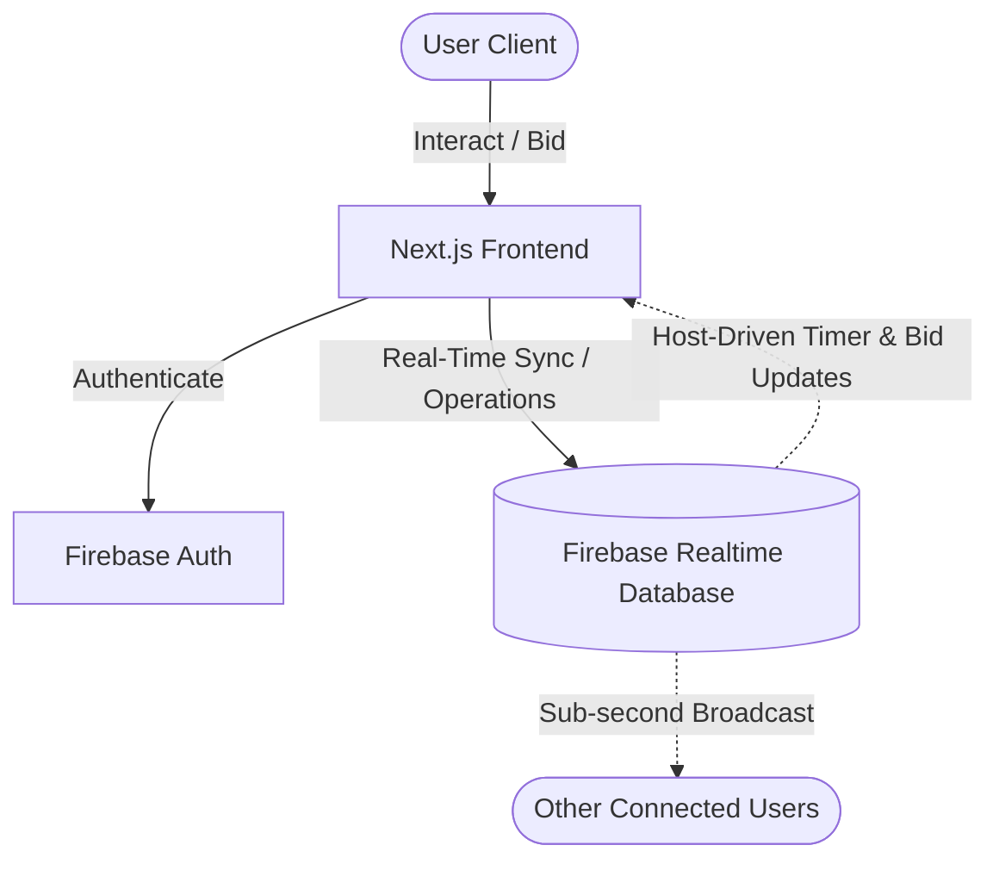

# CricBid

<div align="center">

### **"Bid. Draft. Dominate."**

*A Real-Time, Multiplayer IPL-Style Player Auction Platform — Built for Cricket Fans who want to Manage Franchises like a Pro.*

[](https://nextjs.org)
[](https://www.typescriptlang.org)
[](https://firebase.google.com)
[](https://tailwindcss.com)
[](https://cricbid.vercel.app)

---

[🚀 Explore Live App](https://cricbid.vercel.app) · [🐞 Report Bug](https://github.com/justdarshan510/cricbid/issues) · [💡 Request Feature](https://github.com/justdarshan510/cricbid/issues)

</div>

---

## 📖 Overview

**CricBid** is a highly interactive, real-time multiplayer auction platform that captures the excitement, strategic complexity, and fast-paced drama of the IPL Mega Auctions. 

Designed for both casual cricket enthusiasts and fantasy league strategists, CricBid supports multiplayer rooms where users select their favorite franchises, manage a starting budget, place live bids, and build balanced squads. Utilizing **Firebase Realtime Database**, CricBid provides instant state-synchronization across all active users in a lobby with sub-second latency.

---

## ✨ Features

CricBid is packed with features designed to replicate a authentic auction atmosphere:

*   🌐 **Real-time Multiplayer Auctions** — Create custom rooms, invite friends, and run auctions with synchronized timers.
*   🏏 **IPL Franchise Selection** — Claim your favorite official IPL franchise (CSK, MI, RCB, KKR, SRH, etc.) with custom logos and assets.
*   🎨 **Dynamic Team Backgrounds** — The entire UI adapts its colors, ambient glow, and high-quality backgrounds dynamically based on your selected franchise.
*   ⚡ **Live Bid Synchronization** — Instant, concurrent bid updates ensure that bids are captured at sub-second speeds.
*   📈 **Smart Bid Increment System** — Auto-calculates standard bidding increments mirroring real-world IPL rules.
*   💰 **Purse & Budget Management** — Real-time tracking of team purse balances, budget thresholds, and player costs.
*   🧩 **Squad Building & Roles** — Assemble balanced squads categorizing players by role (Openers, All-Rounders, Spinners, Fast Bowlers, etc.).
*   🔐 **Google Authentication** — Secure, one-click authentication powered by Firebase Auth.
*   🔄 **Room Rejoin Support** — Never lose your spot. Seamlessly reconnect and sync back to active rooms after network dropouts.
*   🔥 **Firebase Realtime Database** — Cloud-powered backend that handles state management without traditional server overhead.
*   📱 **Responsive UI** — Beautifully optimized for Desktop, Tablet, and Mobile devices.
*   🚀 **Global Vercel Deployment** — Edge-optimized deployment with ultra-fast page loads.

---

## 🏗️ Architecture

CricBid uses a serverless multiplayer architecture. Since hosting socket connections on serverless platforms (like Vercel) can be problematic, the synchronization layer is entirely driven by **Firebase Realtime Database (RTDB)**. The host client drives the countdown timers and state transitions, which instantly update in the database and push down to all active room participants.

### Interaction Flow

```
                      ┌─────────────────────────────────┐
                      │              User               │
                      │       (Browser / Mobile)        │
                      └────────────────┬────────────────┘
                                       │
                                       ▼
                      ┌─────────────────────────────────┐
                      │        Next.js Frontend         │
                      │  App Router · Tailwind · React  │
                      └────────┬──────────────┬─────────┘
                               │              │
                               ▼              ▼
                     ┌───────────┐      ┌─────────────┐
                     │ Firebase  │      │  Firebase   │
                     │   Auth    │      │  Realtime   │
                     │  (Google  │      │  Database   │
                     │  Sign-In) │      │   (RTDB)    │
                     └───────────┘      └──────┬──────┘
                                               │
                                               ▼
                                  ┌───────────────────────────┐
                                  │   Real-Time Sync Event    │
                                  │   (Bid, Timer, Roster)    │
                                  └───────────────────────────┘
```

### System Topology (Mermaid)



---

## 📋 Auction Rules

CricBid implements the authentic rules of the official Indian Premier League (IPL) auction system to keep gameplay fair, realistic, and highly competitive.

### 💵 Starting Purse
Each team is allotted a maximum purse of **₹120 Crore** to acquire a complete squad.

### 📊 Smart Bid Increments
Bidding values scale dynamically to speed up early phases and add gravity to late-stage player acquisitions:

| Current Bid Value | Minimum Increment |
| :--- | :--- |
| **₹0 – ₹2.00 Cr** | +₹0.10 Cr |
| **₹2.00 – ₹5.00 Cr** | +₹0.20 Cr |
| **₹5.00 – ₹10.00 Cr** | +₹0.50 Cr |
| **₹10.00 – ₹20.00 Cr** | +₹1.00 Cr |
| **₹20.00 Cr+** | +₹2.00 Cr |

### ⏱️ Auction Timer
Once a player is active under the hammer, a **20-second countdown** begins. 
* Every new bid resets the timer back to **20 seconds**.
* If the timer reaches **0**, the player is sold to the current highest bidder.

---

## 🛠️ Tech Stack

### Frontend & UI
*   **Next.js 15 (App Router)** — Modern React framework for routing, performance, and SEO.
*   **React 19** — State-of-the-art UI library for building modular, interactive components.
*   **TypeScript** — Strictly-typed code patterns to ensure stability and robust contracts.
*   **Tailwind CSS 4** — Utility-first, performance-tuned CSS framework for rapid and precise styling.
*   **Framer Motion** — High-performance interactive animations and transitions.

### Backend & Cloud Infrastructure
*   **Firebase Realtime Database** — Real-time WebSockets-powered database for sub-second multiplayer state replication.
*   **Firebase Authentication** — Secure client-side OAuth for managing user identities.

### Hosting & Deployment
*   **Vercel** — Automated CI/CD, production builds, and global edge network delivery.

---

## 📸 Screenshots

| 🏠 Lobby & Room Setup | 🎨 Franchise Selection |
| :---: | :---: |
|  |  |

| 🔨 Live Bidding Board | 📋 Squad Builder & Purse |
| :---: | :---: |
|  |  |

---

## 📁 Project Structure

```
cricbid/
├── src/
│   ├── app/                # App Router layouts, routes, and styles
│   ├── components/         # Reusable presentation and interactive UI elements
│   ├── context/            # Context API providers (Auth, Auction, Multiplayer)
│   ├── data/               # Static configurations (Backgrounds, Player lists)
│   ├── services/           # Firebase SDK utilities and database interactions
│   └── types/              # Domain-specific TypeScript declarations
├── public/                 # Static assets (logos, background images, icons)
├── database.rules.json     # Firebase Realtime Database security rules
├── vercel.json             # Vercel deployment configuration
└── .env.example            # Environment variables template file
```

---

## 🚀 Getting Started

Follow these steps to run a local copy of CricBid on your development machine:

### Prerequisites
*   **Node.js** (v18.0.0 or higher recommended)
*   **npm** or **Yarn**
*   A **Firebase Project** configured with a Realtime Database

### Installation

1.  **Clone the Repository:**
    ```bash
    git clone https://github.com/justdarshan510/cricbid.git
    cd cricbid
    ```

2.  **Install Project Dependencies:**
    ```bash
    npm install
    ```

3.  **Configure Environment Variables:**
    Duplicate the example file and populate it with your Firebase project credentials:
    ```bash
    cp .env.example .env.local
    ```

4.  **Launch the Local Development Server:**
    ```bash
    npm run dev
    ```
    Open [http://localhost:3000](http://localhost:3000) in your browser to view the application.

---

## 🔑 Environment Variables

To run the application, create a `.env.local` file at the root of the project and supply the following variables:

```env
# Client-side Firebase Configuration (Exposed to Browser)
NEXT_PUBLIC_FIREBASE_API_KEY=your_api_key
NEXT_PUBLIC_FIREBASE_AUTH_DOMAIN=your_project_id.firebaseapp.com
NEXT_PUBLIC_FIREBASE_DATABASE_URL=https://your_project_id-default-rtdb.firebaseio.com
NEXT_PUBLIC_FIREBASE_PROJECT_ID=your_project_id
NEXT_PUBLIC_FIREBASE_STORAGE_BUCKET=your_project_id.appspot.com
NEXT_PUBLIC_FIREBASE_MESSAGING_SENDER_ID=your_sender_id
NEXT_PUBLIC_FIREBASE_APP_ID=your_app_id
```

> [!IMPORTANT]
> All environment variables used in the frontend must be prefixed with `NEXT_PUBLIC_` so they are bundled into the client build. Ensure `.env.local` is listed in your `.gitignore` to avoid exposing API keys.

---

## 🗺️ Future Roadmap

CricBid is actively maintained. Here are the core features planned for future updates:

*   🤖 **AI-Driven Smart Draft Suggestions** — Recommendation engine providing optimal draft targets based on current budget and roster needs.
*   📊 **Deep Player Analytics** — Integrated charts and statistical indicators representing players' historical performance and projected auction values.
*   📜 **Historical Auction Ledger** — Review transaction logs, bidding histories, and price trends after the auction concludes.
*   🏆 **Competitive Leaderboards** — Real-time squad rating algorithm evaluating draft results and scoring rosters.
*   🎫 **Full Tournament Mode** — Group stages, draft rounds, and matches generated from custom-drafted teams.
*   🛡️ **Admin Control Panel** — Interactive host panel allowing customized timers, custom player lists, and moderator options.

---

## 🤝 Contributing

Contributions are what make the open source community such an amazing place to learn, inspire, and create. Any contributions you make are **greatly appreciated**.

1.  Fork the Project
2.  Create your Feature Branch (`git checkout -b feature/AmazingFeature`)
3.  Commit your Changes (`git commit -m 'Add some AmazingFeature'`)
4.  Push to the Branch (`git push origin feature/AmazingFeature`)
5.  Open a Pull Request

---

## 👤 Author

**Darshan**
*   GitHub: [@justdarshan510](https://github.com/justdarshan510)

---

## 📄 License

Distributed under the MIT License. See `LICENSE` for more information.

---

<div align="center">

**⭐ If CricBid caught your attention, feel free to star the repo on GitHub!**

*Built with ❤️ for cricket fans worldwide.*

</div>
